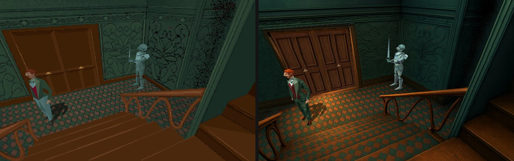
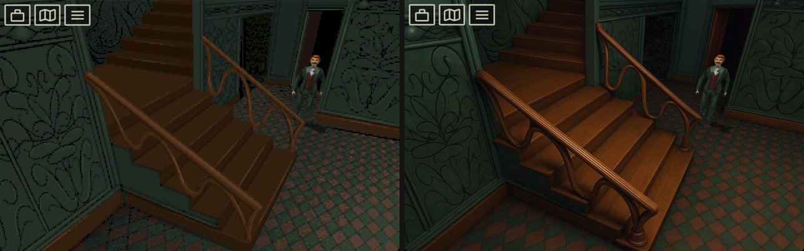
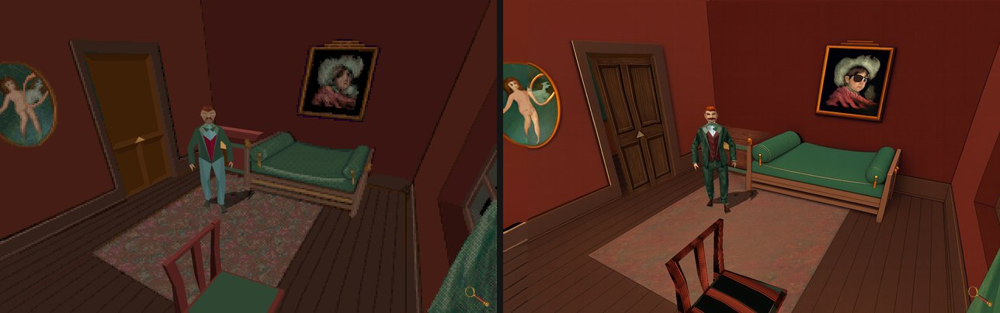
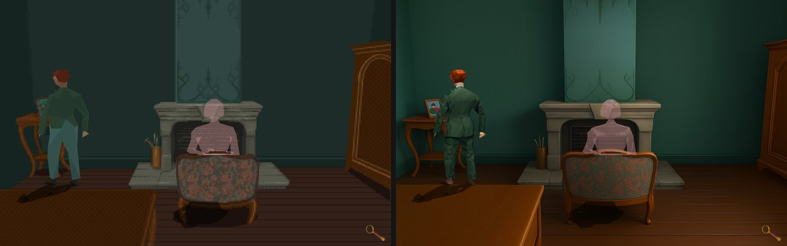
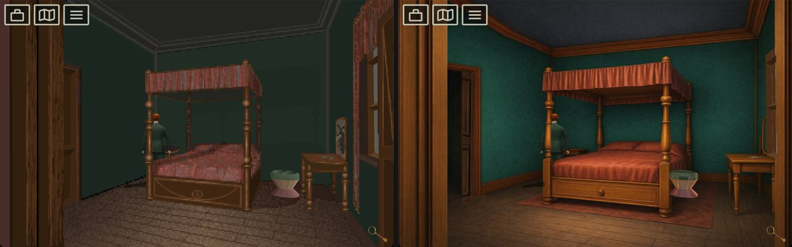
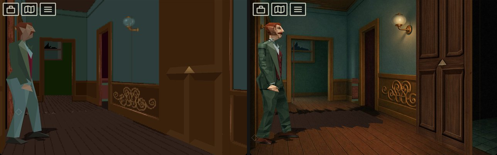

# Alone In The Dark: Re-Haunted v2

A remaster of the 1992 survival horror game. Re-Haunted (AITD-R) reimplements
the Infogrames engine in C++ ([FITD](https://github.com/yaz0r/FITD), here called Tatou) with bgfx rendering,
SoLoud audio and SDL3 input. It runs on Windows, Linux and macOS 11.3+ under
the **GNU GPL v2**.

## This fork

A fork of
[spacefarergames/AloneInTheDarkReHaunted](https://github.com/spacefarergames/AloneInTheDarkReHaunted)
focused on *Alone in the Dark 1*. It adds:

- **Accessibility.** The whole game plays with the mouse's left button alone
  ([Mouse](#mouse-left-button-only)). Optional assists (automatic
  counter-attack, slower enemy attacks) make fights easier. Keyboard and
  gamepad play are unchanged.
- **A native macOS port** for Apple Silicon (arm64)
  ([docs/BUILDING.md](docs/BUILDING.md#macos-apple-silicon)).
- **HD asset tools** to pack the HD backgrounds and to generate, check and
  import HD character models ([HD assets](#hd-assets)).

*Original project © 2026 Infogrames.*

## Original Upscaled vs HD

Seven saved games: the original graphics upscaled on the left; HD
backgrounds, HD character models and post effects on the right.














## Game data

The game files are **not** included. You need to own *Alone in the Dark 1*
([Steam](https://store.steampowered.com/app/548090/Alone_in_the_Dark_1/),
[GOG](https://www.gog.com/en/game/alone_in_the_dark_the_trilogy_123) or the
CD).

1. Find the game's `INDARK` folder, which holds `LISTBODY.PAK`, `ETAGE00.PAK`,
   `CAMERA00.PAK`, `OBJETS.ITD`, `VARS.ITD` and the rest:
   - **GOG (macOS):** `Alone in the Dark 1.app` → *Show Package Contents* →
     `Contents/Resources/game/INDARK/`
   - **Steam / GOG (Windows):** `<install folder>/INDARK/`
   - **CD-ROM:** `INDARK/` on the disc
2. Copy its contents into `data/aitd1/` at the repository root (`data/` is
   git-ignored).

On Windows the engine can also find a Steam, GOG or CD install and copy the
files itself (`gamedata.steamless = true` turns this off). macOS and Linux
builds do not search.

The game reads its files from the folder it starts in and writes
`aitd_remaster.cfg` there, so that folder must be writable.

## Build and run

**macOS and Linux**

```bash
git clone https://github.com/felipe-dos-santos81/alone-in-the-dark-re-haunted-v2.git
cd alone-in-the-dark-re-haunted-v2
make deps        # Linux only: build dependencies (apt, dnf or pacman)
make run         # build the game and play from data/aitd1
```

`make help` lists every target, including tests, HD assets and cleanup.

**Windows**

In `TatouSource\build`, run `vs2022.bat` (or `vs2026.bat`) and open the generated
solution. Make **Fitd** the startup project, set its working directory
(Project → Properties → Debugging) to your game data folder, and press **F5**.
The build writes `Tatou.exe` and copies the HD models next to it, where the
game finds them.

Full instructions for every platform: [docs/BUILDING.md](docs/BUILDING.md).

## Controls

### Keyboard

| Action | Key |
|--------|-----|
| Walk / turn | Arrow keys or **W A S D** |
| Run | **Left Shift** |
| Action / fight | **Space** |
| Inventory / confirm | **Enter** |
| System menu / cancel | **Escape** |
| Quick turn | **Q** / **E** |
| Options dialog | **F1** or **Home** |
| Fullscreen | **F11** or **Alt+Enter** |

Rebind keys under **Controls** in the system menu.

### Mouse (left button only)

| Action | Mouse |
|--------|-------|
| Walk | **Hold** on the floor: the hero follows the pointer and stops when you let go |
| Run | **Double-click and hold** |
| Use an object | **Hold** on it: the hero walks to it and touches it |
| Push | **Hold** on pushable scenery |
| Fight | **Click** an enemy |
| Inventory / map / menu | **Click** the icons at the top left; every screen also works by click |

- The cursor shape shows what a click would do; "not allowed" means nothing.
- The game never locks or confines the cursor.
- Any key or gamepad button takes the hero back from the mouse.
- Turn mouse play off in **F1 → Controls → Mouse gameplay**
  (`controls.mouseGameplay = false`).
- Outside gameplay, a double-click on empty space toggles fullscreen.

### Gamepad (Xbox layout)

| Action | Button (PlayStation) |
|--------|----------------------|
| Move | Left stick / D-pad |
| Run | **L3** |
| Action / fight | **A** (✕) |
| Inventory / confirm | **Start** (Options) |
| System menu / cancel | **B** (○) |
| Quick turn | **LB** / **RB** (L1 / R1) |

Controllers are hot-pluggable; rebind their buttons in the **Controls** menu.

## Configuration

**F1** opens the options dialog, which also shows at startup. Settings are
saved in `aitd_remaster.cfg` next to the game data;
[docs/configuration.md](docs/configuration.md) lists every key and its default.
HD backgrounds are off and HD character models on by default
(`graphics.hdBackgrounds`, `graphics.hdModels`).
[docs/REMASTER.md](docs/REMASTER.md) describes the remaster features.

## HD assets

**Backgrounds** are finished art in `Assets/backgrounds_hd`. They show when
`graphics.hdBackgrounds = true`; `make hd-install` packs them into the app.

**Character models** replace the classic bodies when `graphics.hdModels = true`:

```bash
make tools-deps       # once: the Python venv for the tools
make export-models    # original bodies -> data/models
make blender-models   # refine them in Blender -> data/models-ai
make import-models    # check them and pack them into Assets/models_hd
make build-fitd       # the build copies the models next to the game
```

`make check-models` runs the checks without importing. Format:
[docs/model-contract.md](docs/model-contract.md); in-game sign-off:
[docs/hd-models-checklist.md](docs/hd-models-checklist.md).

**Font:** `Assets/fonts` holds IM Fell English (SIL Open Font License,
`OFL.txt`) for the TrueType text (`font.enableTTF`); every build copies it next
to the game.

**Portuguese text** is in `Assets/lang/pt-BR`; `make lang-pack` checks it and
rebuilds the copy compiled into the game. In-game sign-off:
[docs/translation-checklist.md](docs/translation-checklist.md).

## Remaster features

| Feature | Details |
|---------|---------|
| Native life scripts | LISTLIFE converted to C |
| Dynamic lamp lighting | Lights the HD backgrounds, with AO inspired by AITD4 |
| HD backgrounds | 2×–8× camera views, including animated ones; hand-edited depth masks |
| HD and textured models | Replacement meshes and texture atlases |
| TTF fonts | Anti-aliased overlay text through ImGui |
| Post-processing | Bloom, film grain, SSAO, vignette, SSGI, light probes |
| Controllers | Xbox, PlayStation, Switch Pro and other SDL3 gamepads |
| Mouse gameplay | Left button only; never locks the cursor |
| Combat assists | Automatic counter-attack and slower enemy attacks (AITD1) |
| Maps and hints | Interactive mansion maps; highlighted interactable objects |
| Voice-over | CD voice-over for books and letters |
| Languages | English, French, Italian, Spanish, German, and Brazilian Portuguese (this fork) |
| Quality of life | Fullscreen toggle, transparent menus, crash log (`crash_log.txt`), update check |

## Supported games

| Game | Status |
|------|--------|
| Alone in the Dark 1 | ✅ Completable |
| Jack in the Dark (promo) | ✅ Completable; a separate release, so keep it in its own folder |
| Alone in the Dark 2 | In progress, as [a separate fork](https://github.com/spacefarergames/AloneInTheDarkJackIsBackAgain/) |
| Alone in the Dark 3 | Planned |

## Repository layout

```
alone-in-the-dark-re-haunted-v2/
├── TatouSource/         # CMake project
│   ├── Fitd/            # executable (Tatou)
│   ├── FitdLib/         # engine library: mouse/, models/, assist/, physics/, shaders/
│   ├── ThirdParty/      # SDL3, bgfx, ImGui, SoLoud, zlib, doctest
│   ├── tests/engine/    # doctest unit tests (make test-engine)
│   └── tools/           # .hda archive tools
├── tools/               # Python HD model tools
├── tests/tools/         # its pytest suite (make test-tools)
├── Assets/              # HD backgrounds, masks, atlases, models and the TTF font
├── docs/                # guides, contracts, in-game checklists, screenshots
└── data/                # your game files and exports (git-ignored)
```

[docs/ARCHITECTURE.md](docs/ARCHITECTURE.md) explains the engine modules and data flow.

## Contributing

See [docs/CONTRIBUTING.md](docs/CONTRIBUTING.md). [AGENTS.md](AGENTS.md) holds this
fork's firm rules, such as never locking the cursor and keeping keyboard play
unchanged.

## License

GNU General Public License v2 ([LICENSE](LICENSE)). The original game data is
not included.
