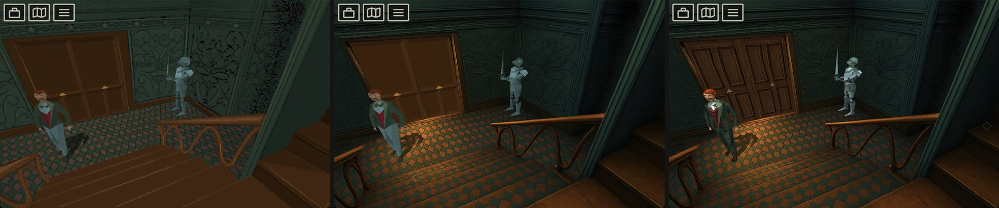
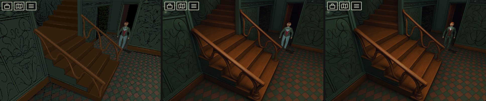
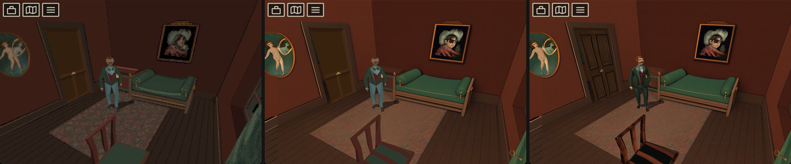
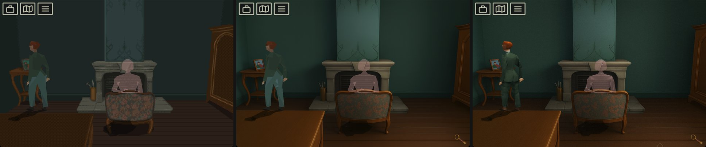
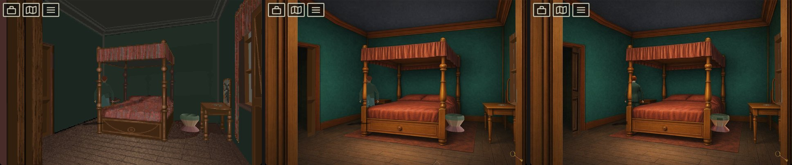
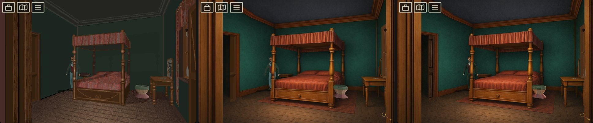
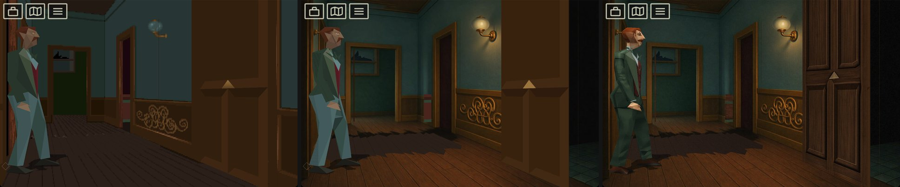

# Alone In The Dark: Re-Haunted v2

A remaster of the 1992 survival horror game. Re-Haunted (AITD-R) reimplements
the Infogrames engine in C++ ([FITD](https://github.com/yaz0r/FITD), here
called Tatou) with bgfx rendering, SoLoud audio and
[SDL3](https://github.com/libsdl-org/SDL) input. It runs on Windows, Linux and
macOS 11.3+ under the **GNU GPL v2**.

## This fork

A fork of
[spacefarergames/AloneInTheDarkReHaunted](https://github.com/spacefarergames/AloneInTheDarkReHaunted)
focused on *Alone in the Dark 1*. It adds:

- **Accessibility.** The whole game plays with the mouse's left button alone;
  keyboard and gamepad play are unchanged.
  - **Mouse gameplay.** The left button walks, runs, uses and pushes objects,
    and works every menu ([Mouse](#mouse-left-button-only)). On by default
    (`controls.mouseGameplay`).
  - **Fighting with a left-click.** A click on an enemy turns the hero to face
    it and strikes or fires with what is in hand. With fists a click punches
    and a double-click kicks.
  - **Combat assists.** Two options in **F1 → Controls → Combat**, both off by
    default: the hero hits back once after an enemy's blow
    (`controls.autoCounterAttack`), and enemies attack slower or much slower
    (`controls.enemyAttackPace`).
  - **A HUD for the mouse.** Icons at the top left open the inventory, the map
    and the system menu, so no key is needed.
- **Brazilian Portuguese.** The game text and the remaster's menus are
  translated; pick **Português** in the language menu
  ([docs/REMASTER.md](docs/REMASTER.md#languages)).
- **HD character models.** Smooth-shaded, textured meshes replace the classic
  bodies and play every original animation; joints bend smoothly and a curve
  through the keyframes keeps the motion fluid. On by default
  (`graphics.hdModels`).
- **External music.** Each song plays from an audio file in a `music` folder,
  so any soundtrack can replace the original ([Music](#music)). On by default
  (`music.external`).
- **A native macOS port** for Apple Silicon (arm64)
  ([docs/BUILDING.md](docs/BUILDING.md#macos-apple-silicon)).
- **HD asset tools** to pack the HD backgrounds and to generate, check and
  import HD character models ([HD assets](#hd-assets)).

*Original project © 2026 Infogrames.*

## Original, Upscaled, HD

Seven saved games, three times each:

- **Original:** every enhancement off: the original backgrounds and character
  bodies, no post effects.
- **Upscaled:** the upscaled HD backgrounds and depth masks, with the original
  character bodies and no post effects.
- **HD:** everything on: HD backgrounds, HD character models and post effects.















## Game data

The game files are **not** included. You need to own *Alone in the Dark 1*
([Steam](https://store.steampowered.com/app/548090/Alone_in_the_Dark_1/),
[GOG](https://www.gog.com/en/game/alone_in_the_dark_the_trilogy_123) or the
CD).

1. Find the game's `INDARK` folder, which holds `LISTBODY.PAK`, `ETAGE00.PAK`,
   `CAMERA00.PAK`, `OBJETS.ITD`, `VARS.ITD` and the rest:
   - **GOG (macOS):** `Alone in the Dark 1.app` → *Show Package Contents* →
     `Contents/Resources/game/INDARK/`
   - **Steam / GOG (Windows):** `<install folder>/INDARK/`
   - **CD-ROM:** `INDARK/` on the disc
2. Copy its contents into `data/aitd1/` at the repository root (`data/` is
   git-ignored).

On Windows the engine can also find a Steam, GOG or CD install and copy the
files itself (`gamedata.steamless = true` turns this off). macOS and Linux
builds do not search.

The game reads its files from the folder it starts in and writes
`aitd_remaster.cfg` there, so that folder must be writable. The macOS app
uses its own `Tatou.app/Contents/Resources` instead.

## Build and run

**macOS and Linux**

```bash
git clone https://github.com/felipe-dos-santos81/alone-in-the-dark-re-haunted-v2.git
cd alone-in-the-dark-re-haunted-v2
make deps        # build dependencies (apt, dnf, pacman or Homebrew)
make run         # build the game and play from data/aitd1
```

`make help` lists every target, including tests, HD assets and cleanup.

**Windows**

In `TatouSource\build`, run `vs2022.bat` (or `vs2026.bat`) and open the
generated solution. Make **Fitd** the startup project, set its working directory
(Project → Properties → Debugging) to your game data folder, and press **F5**.
The build writes `Tatou.exe` and copies the HD models next to it, where the
game finds them.

Full instructions for every platform: [docs/BUILDING.md](docs/BUILDING.md).

## Controls

### Keyboard

| Action | Key |
|--------|-----|
| Walk / turn | Arrow keys or **W A S D** |
| Run | **Left Shift** |
| Action / fight | **Space** |
| Inventory / confirm | **Enter** |
| System menu / cancel | **Escape** |
| Quick turn | **Q** / **E** |
| Options dialog | **F1** or **Home** |
| Fullscreen | **F11** or **Alt+Enter** |

Rebind keys under **Controls** in the system menu.

### Mouse (left button only)

| Action | Mouse |
|--------|-------|
| Walk | **Hold** on the floor: the hero follows the pointer and stops when you let go |
| Run | **Double-click and hold** |
| Use an object | **Hold** on it: the hero walks to it and touches it |
| Push | **Hold** on pushable scenery |
| Fight | **Click** an enemy. With fists a click punches and a **double-click** kicks |
| Inventory / map / menu | **Click** the icons at the top left; every screen also works by click |

- The cursor shape shows what a click would do; "not allowed" means a click
  does nothing.
- The game never locks or confines the cursor.
- Any key or gamepad button takes control of the hero back from the mouse.
- Turn mouse play off in **F1 → Controls → Mouse gameplay**
  (`controls.mouseGameplay = false`).
- Outside gameplay, a double-click on empty space toggles fullscreen.

### Gamepad (Xbox layout)

| Action | Button (PlayStation) |
|--------|----------------------|
| Move | Left stick / D-pad |
| Run | **L3** |
| Action / fight | **A** (✕) |
| Inventory / confirm | **Start** (Options) |
| System menu / cancel | **B** (○) |
| Quick turn | **LB** / **RB** (L1 / R1) |

Controllers are hot-pluggable; rebind their buttons in the **Controls** menu.

## Configuration

**F1** opens the options dialog, which also shows at startup. The game saves
the settings in `aitd_remaster.cfg` next to the game data.

- [docs/configuration.md](docs/configuration.md) lists every key and its
  default.
- [docs/REMASTER.md](docs/REMASTER.md) describes the remaster features.

Every graphics enhancement is on by default: HD backgrounds, HD character
models, every post effect and TrueType text.

## HD assets

**Backgrounds** are finished art in `Assets/backgrounds_hd`. They show when
`graphics.hdBackgrounds = true`; `make hd-install` packs them into the app.

**Character models** replace the classic bodies when `graphics.hdModels = true`:

```bash
make tools-deps       # once: the Python venv for the tools
make export-models    # original bodies -> data/models
make blender-models   # refine them in Blender -> data/models-ai
make import-models    # check them and pack them into Assets/models_hd
make build-fitd       # the build copies the models next to the game
```

`make check-models` runs the checks without importing. Format:
[docs/model-contract.md](docs/model-contract.md); in-game sign-off:
[docs/hd-models-checklist.md](docs/hd-models-checklist.md).

**Font:** `Assets/fonts` holds IM Fell English (SIL Open Font License,
`OFL.txt`) for the TrueType text (`font.enableTTF`); every build copies it next
to the game.

**Portuguese text** is in `Assets/lang/pt-BR`; `make lang-pack` checks it and
rebuilds the copy compiled into the game. In-game sign-off:
[docs/translation-checklist.md](docs/translation-checklist.md).

## Music

With `music.external = true` (the default) each song plays from a file in
`data/aitd1/music`, named by the game's song number: `02.ogg`, `03.ogg` and
so on (`.flac`, `.mp3` and `.wav` also work). A song with no file plays as it
did before, which on a plain data folder is silence.

The numbers are the ones your data's scripts call, and they differ by
release: the CD version calls songs 2 to 17, the floppy version the chip
tunes 0 to 7. A soundtrack made for one release is misplaced on the other.
Four numbers are the remaster's own: `18` is the title theme, looping under
the startup menu; `19`, `20` and `21` are ambient loops for the house, the
underground and the dance hall, heard whenever no scripted song plays. The
system menu's Music ON/OFF silences all of them. The brief for the AI
soundtrack, [docs/music-generation-guide.md](docs/music-generation-guide.md),
targets the CD data.

The macOS app reads its files from its bundle, so `make run` links the folder
there (`make music-install` does only that).

The keys are in [docs/configuration.md](docs/configuration.md#music); in-game
sign-off: [docs/external-music-checklist.md](docs/external-music-checklist.md).

## Remaster features

| Feature | Details |
|---------|---------|
| Native life scripts | LISTLIFE converted to C |
| Dynamic lamp lighting | Lights the HD backgrounds, with AO inspired by AITD4 |
| HD backgrounds | 2×–8× camera views, including animated ones; hand-edited depth masks |
| HD and textured models | Replacement meshes and texture atlases |
| TTF fonts | Anti-aliased overlay text through ImGui |
| Post-processing | Bloom, film grain, SSAO, vignette, SSGI, light probes |
| Controllers | Xbox, PlayStation, Switch Pro and other SDL3 gamepads |
| Mouse gameplay | Left button only; never locks the cursor |
| Combat assists | Automatic counter-attack and slower enemy attacks (AITD1) |
| Maps and hints | Interactive mansion maps; highlighted interactable objects |
| Voice-over | CD voice-over for books and letters |
| External music | One audio file per song (ogg, flac, mp3 or wav) in a `music` folder |
| Languages | English, French, Italian, Spanish, German, and Brazilian Portuguese (this fork) |
| Quality of life | Fullscreen toggle, transparent menus, crash log (`crash_log.txt`), update check |

## Supported games

| Game | Status |
|------|--------|
| Alone in the Dark 1 | ✅ Completable |
| Jack in the Dark (promo) | ✅ Completable; a separate release, so keep it in its own folder |
| Alone in the Dark 2 | In progress, as [a separate fork](https://github.com/spacefarergames/AloneInTheDarkJackIsBackAgain/) |
| Alone in the Dark 3 | Planned |

## Repository layout

```
alone-in-the-dark-re-haunted-v2/
├── TatouSource/         # CMake project
│   ├── Fitd/            # executable (Tatou)
│   ├── FitdLib/         # engine library: mouse/, models/, assist/, text/, anim/, physics/, shaders/
│   ├── ThirdParty/      # SDL3, bgfx, ImGui, SoLoud, zlib, doctest
│   ├── tests/engine/    # doctest unit tests (make test-engine)
│   └── tools/           # .hda archive tools
├── tools/               # Python tools: game data, HD models, translation
├── tests/tools/         # their pytest suite (make test-tools)
├── Assets/              # HD backgrounds, masks, atlases, models, the TTF font and the Portuguese text
├── docs/                # guides, contracts, in-game checklists, screenshots
└── data/                # your game files and exports (git-ignored)
```

[docs/ARCHITECTURE.md](docs/ARCHITECTURE.md) explains the engine modules and data flow.

## Contributing

See [docs/CONTRIBUTING.md](docs/CONTRIBUTING.md). [AGENTS.md](AGENTS.md) holds
this fork's firm rules, such as never locking the cursor and keeping keyboard
play unchanged.

## License

GNU General Public License v2 ([LICENSE](LICENSE)). The original game data is
not included.
